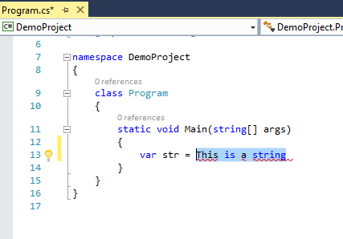
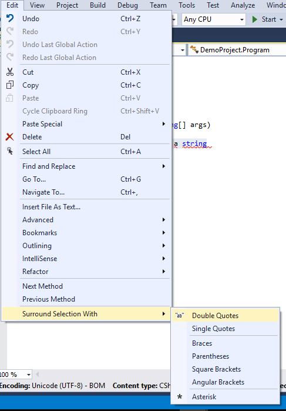
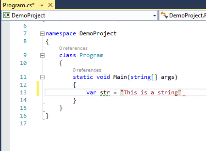

# Surround Selection

<!-- Update the VS Gallery link after you upload the VSIX-->
Download this extension from the [VS Gallery](https://visualstudiogallery.msdn.microsoft.com/[GuidFromGallery])
or get the [CI build](http://vsixgallery.com/extension/4c807d55-9263-4ce0-9c1a-bfef58e96b02/).

---------------------------------------

The quickest way to wrap some selected text with various delimiters like double quotes, single quotes, braces etc.The quickest w
    wrap, selection, quote, braces, bracketsay

See the [change log](CHANGELOG.md) for changes and road map.

## Features
Toggle wrapping of selected text in visual studio with:
- Double Quotes
- Single Quotes
- Braces
- Parentheses
- Square Brackets
- Angular Brackets
- Asterisk

### Steps to use
Select any text in Visual Studio:

Then go to Edit -> Surround Selection with

Click on *Double Quotes* (or any other option) to get the text wrapped around that:

For cloning and building this project yourself, make sure
to install the
[Extensibility Tools 2015](https://visualstudiogallery.msdn.microsoft.com/ab39a092-1343-46e2-b0f1-6a3f91155aa6)
extension for Visual Studio which enables some features
used by this project.

## License
[Apache 2.0](LICENSE)